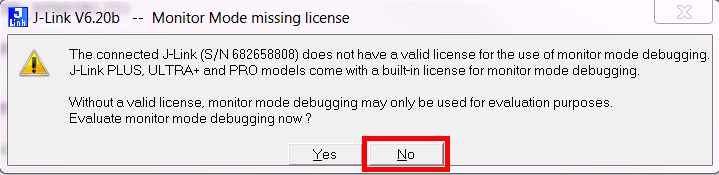

# Monitor Mode Debugging in Keil5

Steps:
1. Unzip/clone into SDK14.2/examples/ble_peripheral

2. Open the keil project file [ble_app_blinky_pca10040_s132.uvprojx](ble_app_blinky_pca10040_s132.uvprojx)

3. Compile the example.

4. Erase and flash an nRF52DK with 's132_nrf52_5.0.0_softdevice.hex' found in SDK14.2\components\softdevice\s132\hex

5. Flash the application to the nRF52DK via Keil. 
NOTE: When prompted with the dialog box 'Monitor Mode missing license' you need to press 'No'. This is done to prevent the J-link driver to enter MMD when flashing the application. You can also flash the application through nrfjprog without any modification. 

6. Enter debug mode.
NOTE: When prompted with the dialog box 'Monitor Mode missing license' you need to press 'Yes'. 

7. Start code execution.

8. Open nRF Connect and connect to 'NORDIC_BLINKY'. Expand the 'Nordic LED Button Service' and enable notifications for the Button characteristics (press the three downward pointing arrows button).

9. Press 'Button 1' on the nRF52DK and verify that the Button characteristic's Value field appears and changes value from 'Button pressed' to 'Button released' when pushing the button.

10. Stop code execution.

11. Verify that the button value in nRF Connect does not change when pressing 'Button 1'

12. Start code execution and verify that the value in nRF Connect now changes when pressing 'Button 1'. 

13. You have now verified that the BLE link remained intact despite halting the CPU. 

14. Feel free to play around with the LED and single stepping through application code. Now you can finally figure out what your BLE service is actually doing without losing the BLE link ^^

## Hey that really is neat, but how do I implement MMD in my project?
The differences between this example and the standard ble_app_blinky demo are listed below:

1. You need to compile the MMD ISR (DebugMon_Handler) found in [JLINK_MONITOR_ISR_ARM.s](../../../JLINK_MONITOR_ISR_ARM.s)

2. You need to stop the app_timer (and feed a watchdog if needed) with the MMD utility functions that the assembly coded ISR refers to in [JLINK_MONITOR.c](../../../JLINK_MONITOR.c) and [JLINK_MONITOR.h](../../../JLINK_MONITOR.h)

3. You need to enable the interrupt by NVIC_SetPriority(DebugMonitor_IRQn, _PRIO_SD_LOW) at the start of your main loop. The priority level determines what execution priority levels you want to block.

4. Enable MMD in the J-link driver: see line 10 and 11 in [JLinkSettings.ini](JLinkSettings.ini)

### Wait, that's it!?
Youp, that's it.

Happy debugging!

