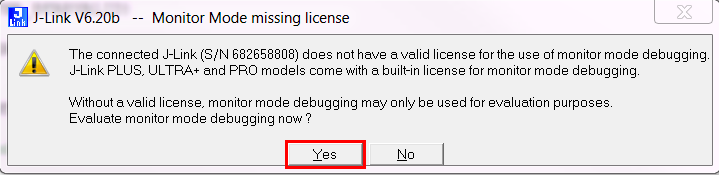

# Monitor Mode Debugging in Segger embedded studios

Segger Embedded Studios has a better integration with MMD than Keil. 

## Steps:

1. Unzip/clone into SDK14.2/examples/ble_peripheral

2. Open the ses project file [ble_app_blinky_pca10040_s132.emProject](ble_app_blinky_pca10040_s132.emProject)

3. Compile the example.

4. Flash the application to the nRF52DK via ses.
NOTE: In SES you have the option to flash additional files, in this example the S132 SoftDevice is flashed automatically. See 'Project->Edit Options->Debug->Loader->Additional Load File'

5. Enter debug mode.

NOTE: When prompted with the dialog box 'Monitor Mode missing license' you need to press 'Yes'.

6. Start code execution.

7. Open nRF Connect and connect to 'NORDIC_BLINKY'. Expand the 'Nordic LED Button Service' and enable notifications for the Button characteristics (press the three downward pointing arrows button).

8. Press 'Button 1' on the nRF52DK and verify that the Button characteristic's Value field appears and changes value from 'Button pressed' to 'Button released' when pushing the button.

9. Stop code execution.

10. Verify that the button value in nRF Connect does not change when pressing 'Button 1'

11. Start code execution and verify that the value in nRF Connect now changes when pressing 'Button 1'.

12. You have now verified that the BLE link remained intact despite halting the CPU.

13. Feel free to play around with the LED and single stepping through application code. Now you can finally figure out what your BLE service is actually doing without losing the BLE link ^^

## Hey that really is neat, but how do I implement MMD in my project?

The differences between this example and the standard ble_app_blinky demo are listed below:

1. You need to compile the MMD ISR (DebugMon_Handler) found in [JLINK_MONITOR_ISR_SES.s](../../../JLINK_MONITOR_ISR_SES.s)

2. You need to stop the app_timer (and feed a watchdog if needed) with the MMD utility functions that the assembly coded ISR refers to in [JLINK_MONITOR.c](../../../JLINK_MONITOR.c) and [JLINK_MONITOR.h](../../../JLINK_MONITOR.h)

3. You need to enable the interrupt by NVIC_SetPriority(DebugMonitor_IRQn, _PRIO_SD_LOW) at the start of your main loop. All the application/protocol_stack context with priority less that the selected priority will be blocked by the DebugMonitor and is available to debug/Step. All the application/protocol_stack context with priority higher than the selected priority will will run uninterrupted irrespective of your debugger state. In this case all we will block all low priority app and softdevice interrupts. But the application high priority interrupts and softdevice radio and house_keeping timer interrupts will run uninterrupted

### Wait, that's it!?

Youp, that's it.

If you have more questions or want to know more then please write a comment.
If you have ideas for improvemnts you can create an issue an/or pull requests that refers to said issue.

Happy debugging!
